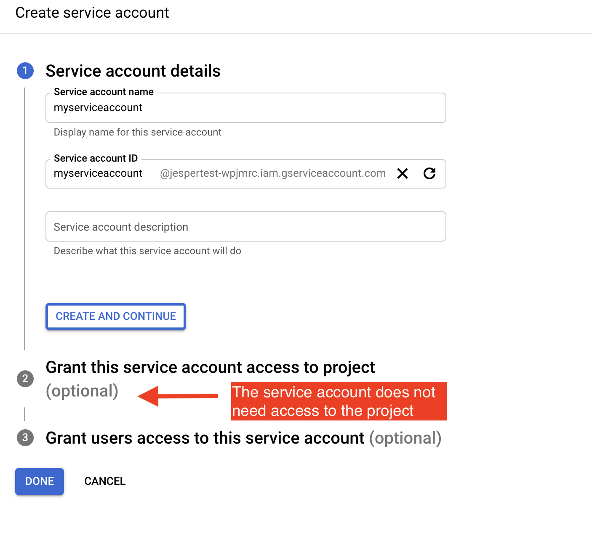
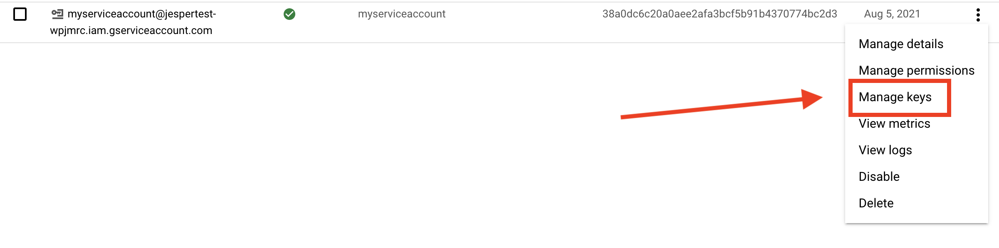
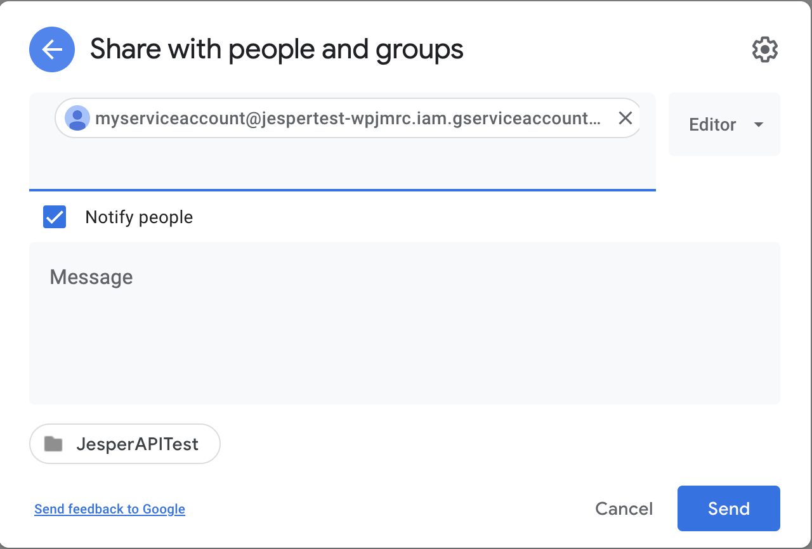

# Interact with Google APIs from Python App

This repo demonstrates how to interact with Google APIs, most specifically Drive API, from a Python app using service account credentials without requiring user-interactive OAuth flows.

# Create Service Account

Go to [Google Cloud Console](https://console.cloud.google.com/) and create or pick the project where you want to create the service account. The service account will not interact with any resources in the project, so it shouldn't matter which one you pick. You must have sufficient permissions on a project to create service accounts.

With your project selected, find the Service Account section using search

Click on the relevant search result to go to the service account page and create a new service account

Fill in a name. You don't need to give the account access to the project.

Open the actions drop-down menu for your newly created service account and select "Manage Keys"

Create a new key

Select JSON format

Once you click "Create", the key json file will be downloaded to your computer. Save the key as `service-account.json` in the root of this repo folder.

Copy the email address of the service account. You will need this in a little bit

# Set up the Google Drive Folder

Log into your Google Drive account and create a new folder. Open sharing for the folder and add the service account email address as an Editor on the folder

Grab the Folder ID from the URL. You will need it in a bit.

# Run the Python script

This project uses [`pipenv`](https://pipenv.pypa.io/). If you use another virtual environment system, it should be straightforward to convert. You'll find dependencies in `Pipfile`.

Set up the environment:

    $ pipenv shell

Run the python script:

    $ python test.py <your google drive folder ID>
    Creating file in folder with id <folder id>
    Open file at https://drive.google.com/file/d/<newly created file id>/view

This should upload a file to the folder called `testfile.csv`. You can open it directly from the printed URL or go find it in your browser.

# References

How to set up credentials to access APIs as a service account (without a user authorization flow):
https://developers.google.com/identity/protocols/oauth2/service-account#python

"Delegate Domain Wide Authority" is not needed. We grant the service account user direct access to the docs and folders.

How to access Drive API from Python. Skip how it creates Credentials
https://developers.google.com/drive/api/v3/quickstart/python

Creating files in folders with Python:
https://developers.google.com/drive/api/v3/folder#python

OAuth2 scopes for Drive v3:
https://developers.google.com/identity/protocols/oauth2/scopes#drive

